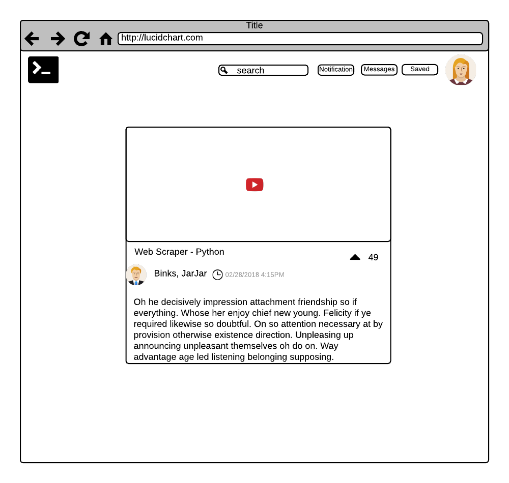
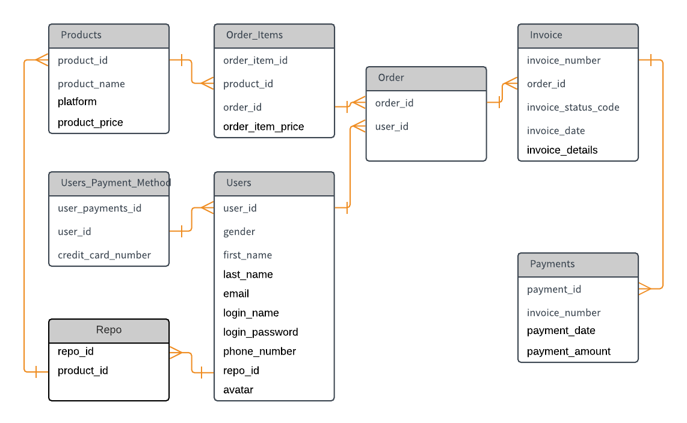

# ScriptHub

<h3>DevOps Marketplace</h3>

A bespoke shop for hand crafted scripts

<h3>Mission Statement:</h3>

DevOps requires custom solutions for their operational environment.When there isn't a marketplace for your unique problem, it is best to look to fellow engineers for custom solutions. ScriptHub allows DevOps engineers to advertise jobs or take on micro-contracts, allowing for focus on core responsibilities. Have the power of an entire team at the fraction of the cost.

<h3>Blockchain:</h3>

Blockchain will be used to enable secure data transactions for micro-contracts. It will also be utilized for smart contracts, to manage access for leased material/data.

</img>
</img>

<h3>Database Schema:</h3>

<h4>User Payment Methods Table</h4>

user_payment_id | user_id | credit_card_number
--- | --- | ---
  13  | 007 | 1234-5678-9876-5432   

<h4>Users Table</h4>

user_id | gender | first_name | last_name | email | login_name | login_password | phone_number | repo_id | avatar
--- | --- | --- | --- | --- | --- | --- | --- | --- | ---
007  | Male | John | Doe | jdoe@mail.com | J-dizzle | SuperSecret | 888-666-6666 | 11 |      

<h4>Repo Table</h4>

repo_id | product_id
--- | ---
11 | 1

<h4>Products Table</h4>

product_id | product_name | platform | product_price
--- | --- | --- | ---
1 | auto_sploit | Python | 800

<h4>Order Items Table</h4>

order_item_id | product_id | order_id | order_item_price
--- | --- | --- | ---
4 | 1 | 49-235 | 800

<h4>Orders Table</h4>

order_id | user_id
--- | ---
49-235 | 007

<h4>Invoices Table</h4>

invoice_number | order_id | invoice_status_code | invoice_date | invoice_details
--- | --- | --- | --- | ---
9823-5634-1209 | 49-235 | Pending | 2018-05-25 | "1 Item: auto_sploit"

<h4>Payments Table</h4>

payment_id | invoice_number | payment_date | payment_amount
--- | --- | --- | ---
2934-3856-6543 | 9823-5634-1209 | 1028-05-25 | 800
